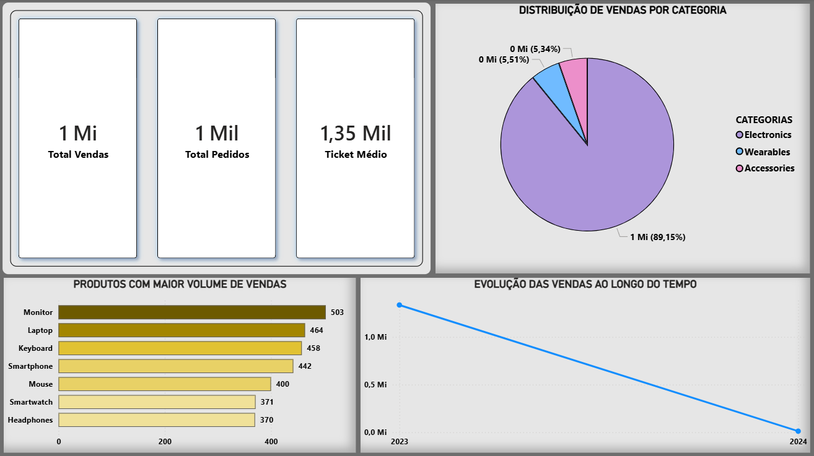

# 📊 Dashboard de Vendas no Power BI

## 🎯 Objetivo
Este projeto tem como objetivo analisar dados de vendas e transformar informações brutas em insights visuais que apoiam a tomada de decisão.

A proposta foi construir um dashboard interativo e de fácil leitura, destacando os principais indicadores de desempenho de vendas.

---

## 🛠️ Ferramentas utilizadas
- Power BI
- Base de dados em CSV
- Modelagem e criação de métricas com DAX

---

## 📊 Indicadores e visualizações

O dashboard foi desenvolvido com foco em clareza e análise de negócio, contendo:

- 💰 **Total de Vendas**  
- 🧾 **Total de Pedidos**  
- 💳 **Ticket Médio**  

### Visualizações:

- 📊 Gráfico de pizza com a distribuição de vendas por categoria (Electronics, Wearables e Accessories)  
- 📦 Gráfico de barras com os produtos com maior volume de vendas  
- 📈 Gráfico de linha mostrando a evolução das vendas ao longo do tempo  

---

## 💡 Principais insights

- As vendas estão concentradas em categorias específicas, indicando maior demanda por determinados tipos de produtos  
- Alguns produtos se destacam significativamente no volume de vendas  
- É possível identificar padrões de crescimento ao longo do tempo, sugerindo tendências de consumo  

---

## 📸 Dashboard

---

## 📂 Estrutura do projeto

- `vendas.csv` → Base de dados utilizada  
- `dashboard.pbix` → Arquivo Power BI (.pbix)  
- `print-dashboard.png` → Imagens do dashboard  
- `README.md` → Documentação do projeto  

---

## 🚀 Sobre o projeto

Este projeto faz parte da minha jornada na área de dados, com foco em desenvolver habilidades em análise, visualização e geração de insights a partir de dados reais.
